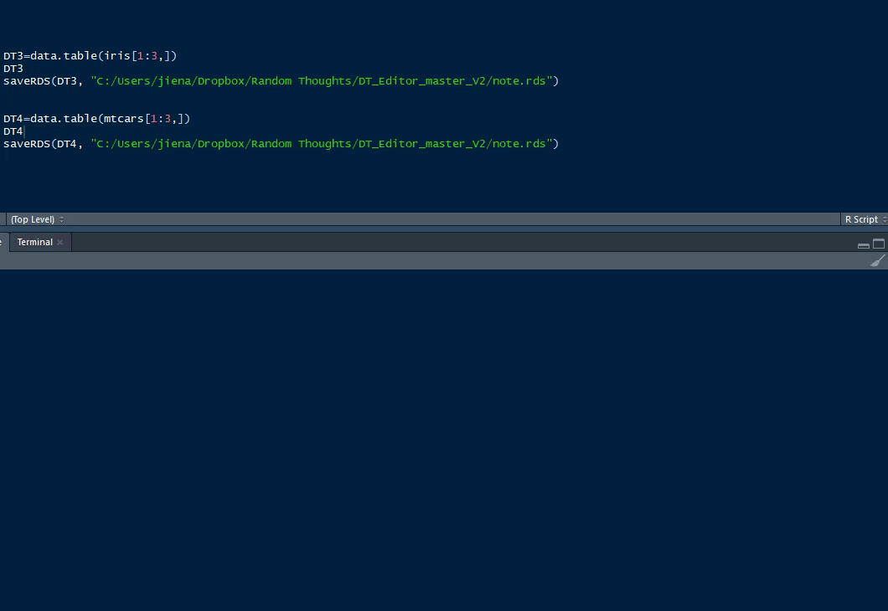

# DT_editor_shiny_module

 * This app utilize shiny module that can fit for any data.table
 You just need to create your data.table and load it to the same location of your shiny app as note.rds
 * Currently, I am working on an elegant way to handle Date format so please convert any date col to character/factor 
 before you load the data.table to this app
 
# Acknowledgement
Eric Nantz (@rpodcast) introduced shiny module to me!

## For example:
```
 DT3=data.table(iris[1:3,])
 saveRDS(DT3, "path of your shiny app/note.rds")
```

